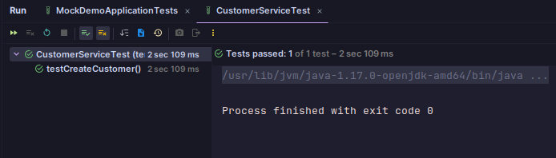
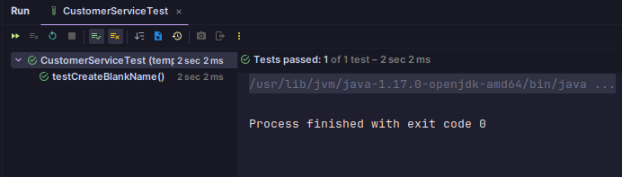
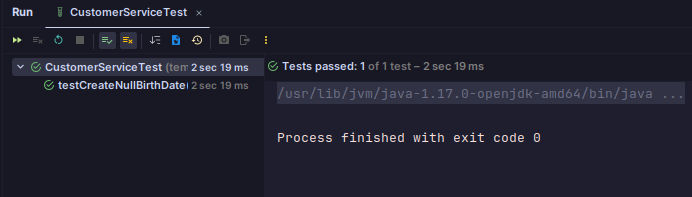
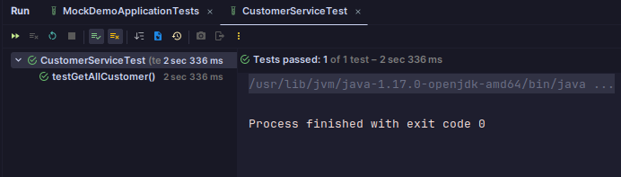
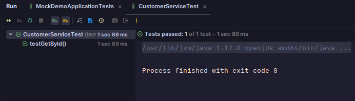
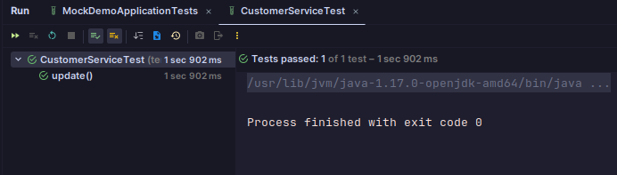
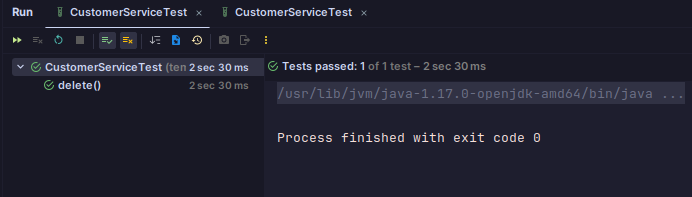

# TEST RESULT DOCUMENTATION

## CREATE CUSTOMER
### CREATE CUSTOMER SUCCESS
Code :

```` java
@Test
public void testCreateCustomer() throws ParseException {
// Given
Customer customer = new Customer();
customer.setName("Budi");
// Parse the date string
String birthDateString = "2001-01-01";
SimpleDateFormat sdf = new SimpleDateFormat("yyyy-MM-dd");
Date birthDate = sdf.parse(birthDateString);
customer.setBirth_date(birthDate);

        // When
        Mockito.when(customerRepository.save(any(Customer.class))).thenReturn(customer);
        Customer createdCustomer = customerService.create(customer);


        // Then
        assertEquals("Budi", createdCustomer.getName());
        assertEquals(birthDate, createdCustomer.getBirth_date());
        Mockito.verify(customerRepository, Mockito.times(1)).save(customer);
    }
````
Output :


### CREATE CUSTOMER FAILED
ServiceImpl code :
````java
@Override
    public Customer create(Customer request) {
        if (request.getName().isBlank()) {
            throw new RuntimeException("Name cannot be blank");
        }
        if (request.getBirth_date()==null) {
            throw new RuntimeException("Birthdate cannot be null");
        }
        if (!isValidDateFormat(request.getBirth_date())) {
            throw new RuntimeException("Invalid birth_date format");
        }

        return customerRepository.save(request);
    }

    private boolean isValidDateFormat(Date date) {
        SimpleDateFormat sdf = new SimpleDateFormat("yyyy-MM-dd");
        sdf.setLenient(false);
        String formattedDate = sdf.format(date);
        return formattedDate.equals(date.toString()); 
    }
````

#### CREATE CUSTOMER WITH BLANK NAME (FAILED ON SERVICE)
Code :
````java
@Test
    public void testCreateBlankName() throws ParseException {
        // Given
        Customer customer = new Customer();
        customer.setName("");
        // Parse the date string
        String birthDateString = "2001-01-01";
        SimpleDateFormat sdf = new SimpleDateFormat("yyyy-MM-dd");
        Date birthDate = sdf.parse(birthDateString);
        customer.setBirth_date(birthDate);

        // Then
        assertThrows(RuntimeException.class, () -> customerService.create(customer));
        then(customerRepository).should(never()).save(any(Customer.class));
    }
````
Output : 

#### CREATE WITH WRONG DATE FORMAT (FAILED ON SERVICE)
Code :
````java
@Test
public void testCreateInvalidDateFormat () throws ParseException {
    // Given
    Customer customer = new Customer();
    customer.setName("Budi");
    // Parse the date string
    String birthDateString = "2000-13-32";
    SimpleDateFormat sdf = new SimpleDateFormat("yyyy-MM-dd");
    Date birthDate = sdf.parse(birthDateString);
    customer.setBirth_date(birthDate);

    // then
    assertThrows(RuntimeException.class, () -> customerService.create(customer));
    then(customerRepository).should(never()).save(any(Customer.class));
}
````
Output : 

#### CREATE WITH NULL BIRTH DATE (FAILED ON SERVICE)
Code :
````java
@Test
    public void testCreateNullBirthDate () throws ParseException {
        // Given
        Customer customer = new Customer();
        customer.setName("Budi");
        // not set any birthdate

        // then
        assertThrows(RuntimeException.class, () -> customerService.create(customer));
        then(customerRepository).should(never()).save(any(Customer.class));
    }
````
Output : 

## GET ALL
### GET ALL CUSTOMER SUCCESS
Code :
````java
@Test
    public void testGetAllCustomer() throws ParseException {
        // given
        String birthDateString1 = "2001-01-01";
        String birthDateString2 = "2002-02-02";
        SimpleDateFormat sdf = new SimpleDateFormat("yyyy-MM-dd");
        Date birthDate1 = sdf.parse(birthDateString1);
        Date birthDate2 = sdf.parse(birthDateString2);
        Customer customer1 = new Customer(1, "Budi", birthDate1);
        Customer customer2 = new Customer(2, "Doremi", birthDate1);

        // when
        Mockito.when(customerRepository.findAll()).thenReturn(List.of(customer1, customer2));
        List<Customer> customerList = customerService.getAll();

        // then
        assertThat(!customerList.isEmpty());
        assertThat(customerList.size()==2);
    }
````
Output :



## GET BY ID
### GET BY ID SUCCESS
Code :
````java
@Test
    public void testGetById() throws ParseException {
        // given
        String birthDateString = "2001-01-01";
        SimpleDateFormat sdf = new SimpleDateFormat("yyyy-MM-dd");
        Date birthDate = sdf.parse(birthDateString);
        Customer customer = new Customer(1, "Budi", birthDate);

        // when
        Mockito.when(customerRepository.findById(1)).thenReturn(Optional.of(customer));
        Customer getOneCust = customerService.getOne(1);

        // then
        assertNotNull(getOneCust);
        assertEquals("Budi", getOneCust.getName());
        assertEquals(birthDate, getOneCust.getBirth_date());
    }
````
Output : 

## UPDATE
### UPDATE SUCCESS
Code :
````java
    @Test
    public void update() throws ParseException {
        // Given
        // Update
        Customer updatedCust = new Customer();
        updatedCust.setId(1);
        updatedCust.setName("Updated Budi");
        SimpleDateFormat sdf = new SimpleDateFormat("yyyy-MM-dd");
        String birthDateStringUpd = "2002-02-02";
        Date birthDateUpd = sdf.parse(birthDateStringUpd);
        updatedCust.setBirth_date(birthDateUpd);

        // When
        Mockito.when(customerRepository.findById(any(Integer.class))).thenReturn(Optional.of(initialCust));
        Mockito.when(customerRepository.save(any(Customer.class))).thenReturn(initialCust);
        Customer updatedCustomer = customerService.update(updatedCust, updatedCust.getId());

        // Then
        Mockito.verify(customerRepository, Mockito.times(1)).findById(1);
        Mockito.verify(customerRepository, Mockito.times(1)).save(initialCust);
        assertEquals(updatedCust.getName(), updatedCustomer.getName());
        assertEquals(updatedCust.getBirth_date(), updatedCustomer.getBirth_date());
    }
````
Output : 

## DELETE
### DELETE SUCCESS
Code :
````java
@Test
    public void delete() {
        // When
        Mockito.when(customerRepository.findById(any(Integer.class))).thenReturn(Optional.of(initialCust));
        customerService.delete(1);
        Customer getDeleteCustomer = customerService.getOne(1);

        // Then
//        assertNull(getDeleteCustomer);
        Mockito.verify(customerRepository, Mockito.times(1)).findById(1);
        Mockito.verify(customerRepository, Mockito.times(1)).deleteById(1);
    }
````
Output : 


